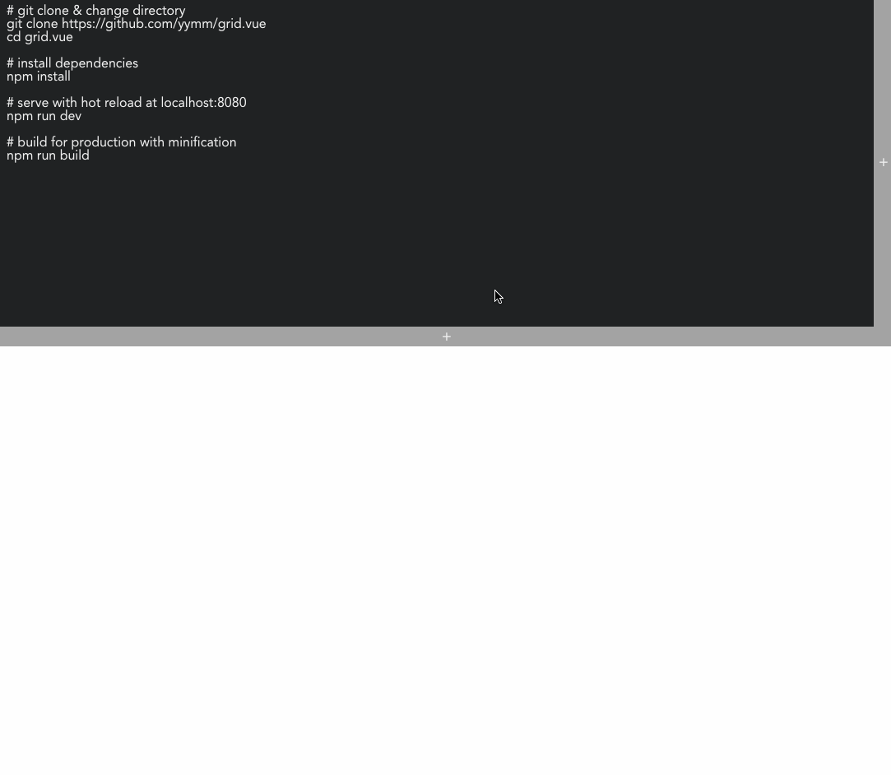

# grid.vue

A Extensible and Resizable grid by Vue.js. Inspired by CodePen editor.



## It's free

If you want to use and modify this component, copy src/Hgrid.vue or src/Vgrid.vue or both then use it as you like.

## Build Setup

This project use vue-cli(vue init webpack-simple grid.vue).

``` bash
# git clone & change directory
git clone https://github.com/yymm/grid.vue
cd grid.vue

# install dependencies
npm install

# serve with hot reload at localhost:8080
npm run dev

# build for production with minification
npm run build
```

For detailed explanation on how things work, consult the [docs for vue-loader](http://vuejs.github.io/vue-loader).
